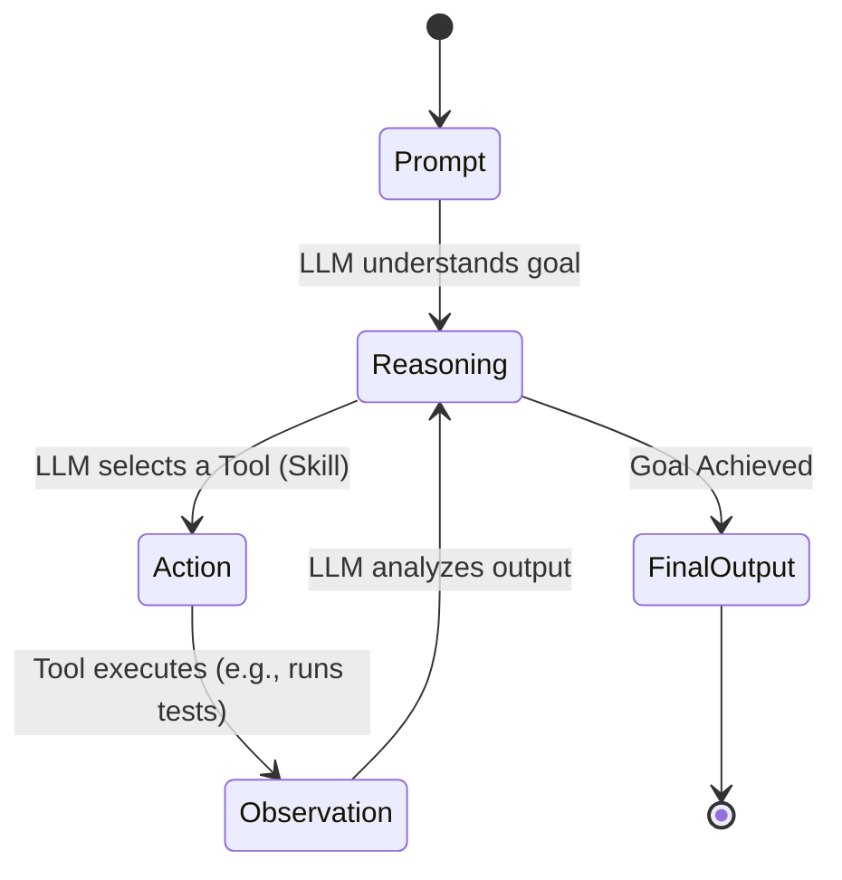

# The Rise of AI Agents and Coding Skills

The software development landscape is undergoing a massive shift. We are moving from simple AI autocomplete tools to fully functional **AI Agents** equipped with "Skills" that allow them to interact with our development environments, run commands, and accomplish complex objectives autonomously.

## From Chat to Agentic Action

Traditional LLMs required developers to copy-paste code back and forth between a chat window and their IDE. The new wave of AI coding assistants operates differently. By adopting an agentic architecture, tools are now capable of executing a loop of **Reasoning and Acting (ReAct)**.

When you give an objective to an AI Agent today, it isn't just generating text; it is utilizing its tools—often referred to as *skills*—to get the job done.

### March 2026 Updates: The Current Elite Agents

The agentic ecosystem is evolving rapidly. As of **March 2026**, here are the most prominent agentic coding tools leading this revolution:

#### 1. Claude Code & Clause 4.6
Anthropic has heavily pushed into the agentic terminal space. In February 2026, they launched **Claude Sonnet 4.6**, drastically lowering token latency, and introduced **Claude Code Security**—a specialized tool that scans codebases for vulnerabilities, analyzing complex data movements just like human security researchers. By grounding the LLM in the actual workspace repository, Claude Code can tackle multi-file refactoring and pinpoint obscure bugs by literally "reading" your terminal output.

#### 2. Gemini CLI & Gemini 3 Pro
Google's Gemini models have been increasingly integrated into developer environments. The latest **Gemini CLI (v0.31.0)** integrates directly with Gemini 3 Pro, bringing native browser agents, custom skill support, and web fetch capabilities right into the terminal. They can capture browser screenshots to verify visual layouts, making frontend development significantly faster.

#### 3. Codex & GitHub Copilot Workspaces
While Copilot started as an autocomplete engine powered by OpenAI's Codex, it has evolved into a task-oriented agent through Copilot Workspace. You can now define a Github Issue, and the AI agent will draft an implementation plan, modify the relevant files, and open a Pull Request entirely autonomously.

## How "Skills" Work Under the Hood

Under the hood, an AI agent's "Skill" is essentially a well-defined function that the LLM is trained to call via structured output. 

Common skills include:
- **File System Operations**: Reading, writing, and searching through files.
- **Terminal Execution**: Running `npm test` or `git grep` and interpreting the output.
- **Browser Automation**: Opening URLs and navigating web pages to verify UX.

## The Future of Engineering

As these tools mature, the role of a software engineer is shifting from purely writing syntax to **orchestrating agents** and reviewing machine-generated architectural changes. Embracing these agentic tools early on will grant developers a massive productivity multiplier.

---

*What AI agent tools have you found most effective in your workflow? Let's connect on [X](https://x.com/aliirsyaadn) or [LinkedIn](https://linkedin.com/in/aliirsyaadn).*
