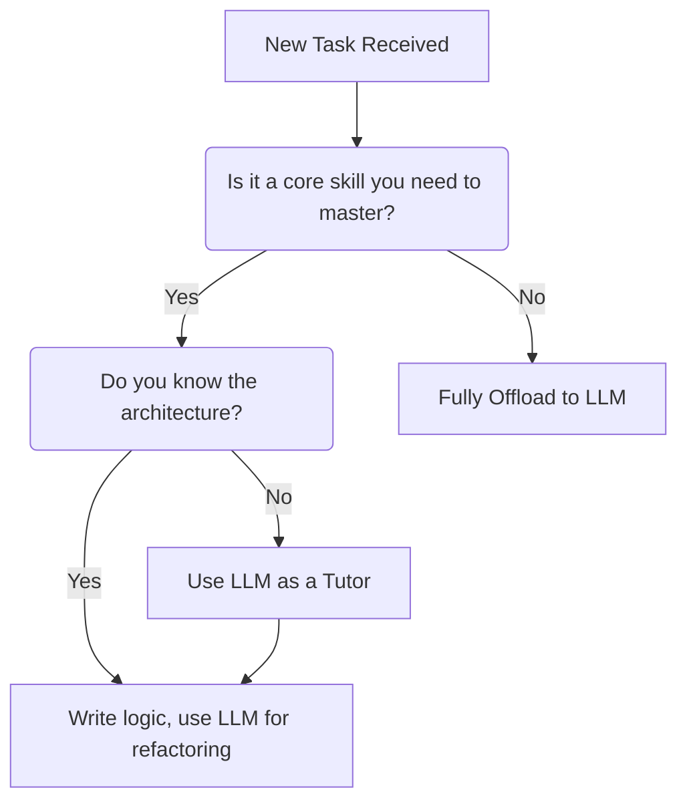

# Cognitive Offloading: Using LLMs to Learn, Not Just Execute

As AI tools like ChatGPT, Claude, and GitHub Copilot become ubiquitous, a common fear has circulated in the engineering community: *"Will relying on AI make me a worse developer?"*

The short answer is: **It depends on how you use it.**

If you use AI solely as an answer-vending machine without understanding the output, your skills will inevitably atrophy. However, if you use AI for **Cognitive Offloading**, it can accelerate your learning curve and make you a more capable engineer.

## What is Cognitive Offloading?

Historically, humans have offloaded cognition to tools like notebooks and calculators. However, LLMs introduce a new dimension by acting as a "virtual second brain" that collaborates and generates ideas.

When we tackle complex software problems, a vast amount of our mental RAM is consumed by remembering syntax, navigating library documentation, or managing build pipeline configurations. Cognitive offloading is the practice of consciously delegating these low-level memorization tasks to an LLM so that your brain can focus entirely on high-level architecture and system design.

### The Psychology: "Cognitive Debt" vs Productivity

Recent neuroscience and psychological research has highlighted a complex paradox with LLMs:
- **The Good:** Offloading offers immediate performance boosts and frees up mental resources for creativity and problem-solving.
- **The Bad:** Studies utilizing electroencephalography (EEG) have shown reduced neural connectivity and lower task engagement in individuals heavily using LLMs. Over-reliance can lead to **"metacognitive laziness"** and what researchers term **"Cognitive Debt"**—a measurable reduction in critical thinking and the ability to problem-solve independently over time.

### The Trap of "Blind Delegation"

The danger arises when cognitive offloading turns into blind delegation. 

❌ **Blind Delegation:** Asking an LLM to "fix this bug," pasting the generated code, seeing that the tests pass, and moving on without reading the code.
✅ **Cognitive Offloading:** Asking an LLM to explain *why* the bug occurred, having it draft a solution, taking the time to read the implementation, and integrating the underlying concept into your mental model.

## A Framework for Delegation

## Recommendations for Learning alongside AI

To ensure you are using AI as an engine for growth rather than a crutch, consider the following strategies:

### 1. Ask for Concepts, Not Just Code
Instead of typing, "Write a regex to extract email addresses," try asking, "Explain how I would construct a regex to match the components of an email address, and provide an example." This shifts the interaction from purely transactional to educational.

### 2. The "Explain It Like I'm 5" Refactor
When an LLM provides a complex snippet of code—perhaps utilizing advanced array methods or a design pattern you aren't familiar with—stop and ask it to explain that specific line. This is the equivalent of having a senior developer sitting next to you for pair programming.

### 3. Write First, Review Second
For crucial algorithms or architectures you want to master, force yourself to write the first draft. Then, feed it into the LLM and prompt: "Review my code. Point out edge cases I missed and suggest performance optimizations, but do not rewrite the whole thing for me."

## Conclusion

We are moving away from an era where developers are judged by how many API endpoints they have memorized. The future belongs to those who possess strong fundamental mental models and can effectively orchestrate AI tools to execute their vision. Offload the syntax, but never offload the learning. 

---

*How do you balance learning with AI assistance? Reach out on [X](https://x.com/aliirsyaadn) or [LinkedIn](https://linkedin.com/in/aliirsyaadn).*
